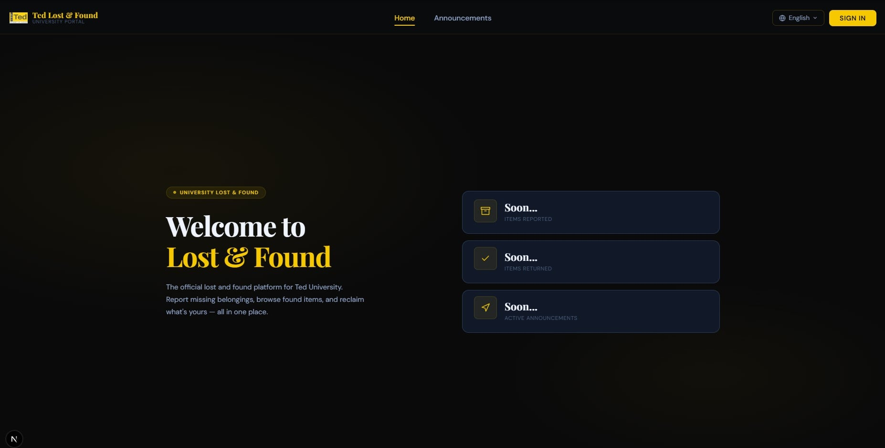
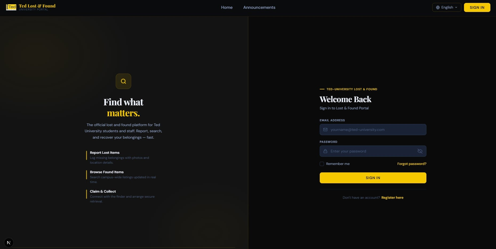
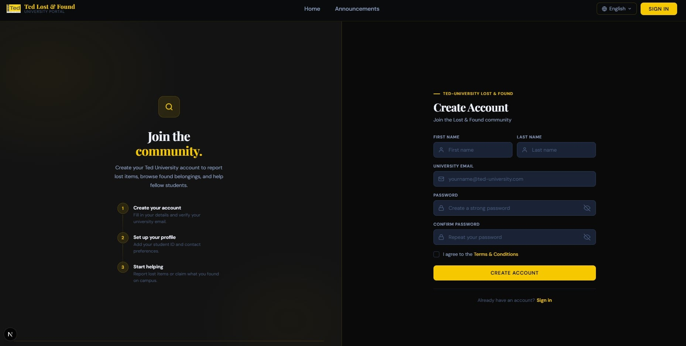

# 🔍 Ted Lost & Found

### University Portal — Ted University

_The official platform to report, find, and reclaim lost belongings on campus._

---

## 📸 Screenshots

### 🏠 Home

### 🔐 Sign In

### 📝 Create Account

---

## ✨ What is this?

**Ted Lost & Found** is the official lost and found portal for Ted University students and staff.

Lost something on campus? Found something that isn't yours? This platform connects both sides — quickly and simply.

---

## 🚀 How it works

**If you lost something**

> Register with your university email → Submit a report describing your item and where you lost it → Wait to be contacted when it's found.

**If you found something**

> Sign in → Post an announcement with a description and photo → The owner will reach out to collect it.

**Everything goes through an admin**

> All reports are reviewed and approved before going live — keeping the platform safe and reliable.

---

## 🌍 Available in English & French

The entire platform is available in both **English** and **French**, switchable at any time from the top navigation.

---

**Developed by Aziz Kammoun, Aziz Soudani & Mohamed Jlassi**

_Ted University — ISP — University by Clevory_

