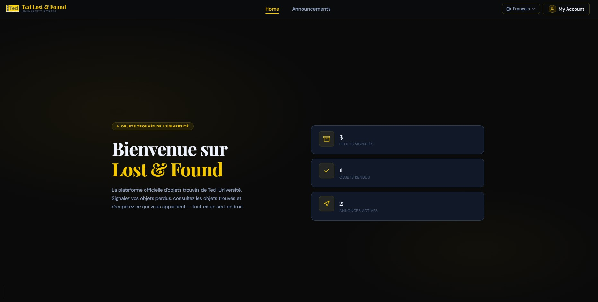
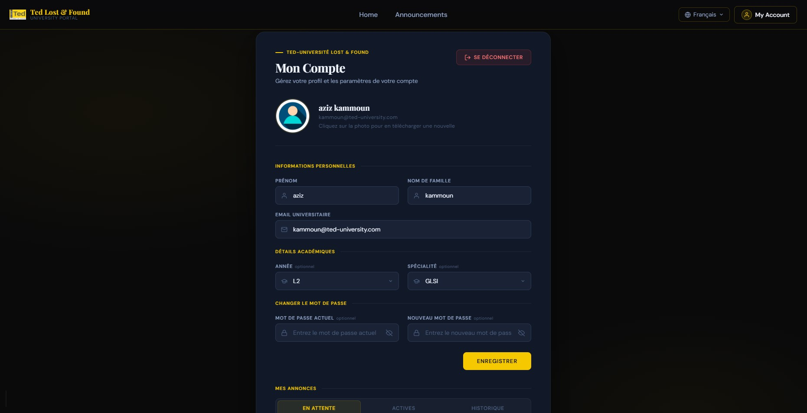
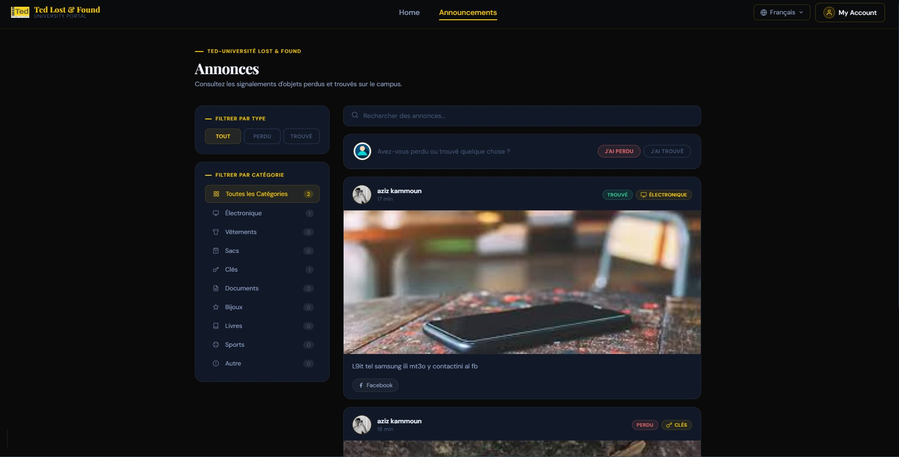
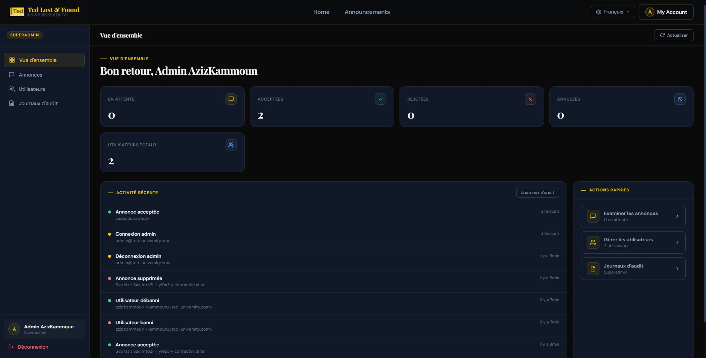

<div align="center">

# 🔍 Ted Lost & Found

### University Portal — Ted University

_The official platform to report, find, and reclaim lost belongings on campus._


</div>

---

## 📸 Screenshots

<table>
  <tr>
    <td align="center" width="50%">
      <strong>🏠 Home</strong><br/><br/>
      
    </td>
    <td align="center" width="50%">
      <strong>👤 Account</strong><br/><br/>
      
    </td>
  </tr>
  <tr>
    <td align="center" width="50%">
      <strong>📢 Announcements</strong><br/><br/>
      
    </td>
    <td align="center" width="50%">
      <strong>🛡️ Admin Dashboard</strong><br/><br/>
      
    </td>
  </tr>
</table>

---

## 📖 What is Ted Lost & Found?

**Ted Lost & Found** is the official lost and found portal for Ted University students and staff. Built as a full-stack web application, it provides a clean, bilingual (English & French) interface for reporting lost items, posting found items, and allowing the community to reconnect belongings with their owners — all managed through a dedicated admin panel.

### Key highlights

- Students can post **lost** or **found** announcements with photos, descriptions, and contact info
- All announcements go through **admin review** before going public — keeping the feed trustworthy
- Admins can **accept, reject, delete**, and manage the full lifecycle of every announcement
- A **superadmin** tier has access to audit logs and full platform oversight
- Real-time stats are pushed to the homepage via **Server-Sent Events (SSE)**
- **JWT-based auth** with refresh token rotation for both users and admins

---

## 🏗️ Architecture Overview

```
lost-And-Found/
├── client/                          # Next.js 14 frontend (React, Tailwind CSS)
│   ├── app/
│   │   ├── [locale]/                # i18n routing (en / fr)
│   │   │   ├── account/             # Account profile page
│   │   │   ├── announcements/       # Public announcements feed
│   │   │   ├── forgot-password/
│   │   │   ├── home/                # Homepage with live stats
│   │   │   ├── login/
│   │   │   ├── register/
│   │   │   └── tedsuperadmin/       # Admin dashboard (protected)
│   │   │       └── adminDashboard.module.css
│   ├── components/                  # Shared UI components
│   │   ├── Icons.tsx
│   │   ├── LanguageSwitcher.tsx
│   │   └── Navbar.tsx
│   ├── i18n/                        # Internationalization
│   │   ├── routing.ts
│   │   └── request.ts
│   ├── lib/
│   │   └── auth.ts
│   ├── messages/                    # Translation files
│   │   ├── en.json
│   │   ├── fr.json
│   │   ├── admin.en.json
│   │   └── admin.fr.json
│   ├── public/
│   │   └── assets/                  # ← Put your screenshots here
│   │       └── ted-logo.jpg
│   ├── .env.local
│   ├── next.config.ts
│   ├── proxy.ts
│   └── tsconfig.json
│
└── server/                          # Express.js backend (Node.js, MongoDB)
    ├── config/
    │   └── Connect_database.js      # MongoDB connection
    ├── controllers/
    │   ├── account/
    │   │   ├── editAccountData.js
    │   │   └── getAccountData.js
    │   ├── admin/
    │   │   ├── adminAnnouncement.js
    │   │   ├── adminAuth.js
    │   │   ├── adminLogs.js
    │   │   └── adminUser.js
    │   └── announcement/
    │       └── announcement.js
    ├── middlewares/
    │   ├── adminMiddleware.js
    │   ├── announcementUpload.js
    │   ├── AuthMiddleware.js
    │   ├── UploadMiddleware.js
    │   ├── validateAnnouncement.js
    │   └── validateEditAccountData.js
    ├── models/
    │   ├── announcement.model.js
    │   ├── Studentdetails.model.js
    │   ├── user.model.js
    │   ├── userSession.model.js
    │   ├── admin.model.js
    │   └── adminLog.model.js
    ├── routers/
    │   ├── account.router.js
    │   ├── admin.router.js
    │   ├── announcement.router.js
    │   └── auth.router.js
    ├── scripts/
    │   └── createAdmin.js           # CLI tool to create admin accounts
    ├── uploads/                     # Uploaded images (gitignored)
    │   ├── announcements/
    │   └── users/
    │       └── default.png
    ├── utils/
    │   ├── adminLogger.js
    │   └── imageCleanup.js
    ├── .env
    └── index.js
```

---

## ⚙️ Prerequisites

Before you begin, make sure you have the following installed:

| Tool                                | Minimum Version | Notes                |
| ----------------------------------- | --------------- | -------------------- |
| [Node.js](https://nodejs.org/)      | v18+            | LTS recommended      |
| [npm](https://www.npmjs.com/)       | v9+             | Comes with Node.js   |
| [MongoDB](https://www.mongodb.com/) | v6+             | Local or Atlas cloud |
| [Git](https://git-scm.com/)         | Any             | For cloning          |

---

## ⚙️ Prerequisites

Before you begin, make sure you have the following installed:

| Tool                                | Minimum Version | Notes                |
| ----------------------------------- | --------------- | -------------------- |
| [Node.js](https://nodejs.org/)      | v18+            | LTS recommended      |
| [npm](https://www.npmjs.com/)       | v9+             | Comes with Node.js   |
| [MongoDB](https://www.mongodb.com/) | v6+             | Local or Atlas cloud |
| [Git](https://git-scm.com/)         | Any             | For cloning          |

---

## 🚀 Installation & Setup

### 1. Clone the repository

```bash
git clone https://github.com/AzizDevX/lost-And-Found.git
cd lost-And-Found
```

---

### 2. Set up the Server (Backend)

```bash
cd server
npm install
```

#### Create `.env` in `/server`

Create a file named `.env` in the `server/` directory with the following content:

```dotenv
# ── Server ─────────────────────────────────────────────
BACKEND_PORT=5000

# ── Database ────────────────────────────────────────────
MONGO_URL=mongodb://127.0.0.1:27017/lost-And-Found

# ── User Auth Tokens ────────────────────────────────────
ACCESS_TOKEN_SECRET=your_super_secret_access_key_here
REFRESH_TOKEN_SECRET=your_super_secret_refresh_key_here

# ── Admin Auth Tokens ───────────────────────────────────
ADMIN_ACCESS_TOKEN_SECRET=your_admin_access_secret_here
ADMIN_REFRESH_TOKEN_SECRET=your_admin_refresh_secret_here

# ── Token Expiry ─────────────────────────────────────────
ACCESS_TOKEN_EXPIRES=15m
REFRESH_TOKEN_EXPIRES=90d

# ── Environment ──────────────────────────────────────────
NODE_ENV=dev
```

> **💡 Tip:** Generate strong secrets using:
>
> ```bash
> node -e "console.log(require('crypto').randomBytes(64).toString('hex'))"
> ```
>
> Run this command 4 times to generate 4 different secrets.

#### Start the server

```bash
# Development (with auto-reload)
npm run dev

# Production
npm start
```

The API will be available at `http://localhost:5000`.

---

### 3. Set up the Client (Frontend)

```bash
cd ../client
npm install
```

#### Create `.env.local` in `/client`

Create a file named `.env.local` in the `client/` directory:

```dotenv
# The full base URL of your backend API
NEXT_PUBLIC_API_URL=http://localhost:5000

# (Optional) Add any other client-side environment variables below
```

> **Note:** If you changed `BACKEND_PORT` in the server `.env`, update the port here to match.

#### Start the client

```bash
# Development
npm run dev

# Production build
npm run build
npm start
```

The frontend will be available at `http://localhost:3000`.

---

## 🔑 Admin Setup

The platform supports two admin roles:

| Role         | Capabilities                                                            |
| ------------ | ----------------------------------------------------------------------- |
| `moderator`  | Review, accept, reject, delete announcements; manage users (ban/unban)  |
| `superadmin` | All moderator permissions + view full audit logs and activity summaries |

### Creating your first admin via CLI

Admins are created using the built-in CLI script — there is no self-registration for admins.

```bash
cd server
node scripts/createAdmin.js
```

You will be prompted interactively:

```
╔══════════════════════════════════╗
║     Lost & Found — Create Admin  ║
╚══════════════════════════════════╝

Username (3-50 chars, a-z 0-9 _ -): admin1
Email: admin@ted-university.com
Password (min 8, uppercase + digit required): ********
Role [moderator/superadmin] (default: moderator): superadmin
```

#### Non-interactive (flags) mode

You can also pass all arguments directly — useful for scripts or CI:

```bash
node scripts/createAdmin.js \
  --username admin1 \
  --email admin@ted-university.com \
  --password Secret123! \
  --role superadmin
```

#### Password rules

Passwords must satisfy all of the following:

- At least **8 characters**
- At least **1 uppercase** letter
- At least **1 lowercase** letter
- At least **1 digit**

#### Example: create a moderator

```bash
node scripts/createAdmin.js \
  --username moderator1 \
  --email mod@ted-university.com \
  --password Moderator1! \
  --role moderator
```

> After creation, the script will print the new admin's ID, username, email, role, and creation timestamp, then disconnect from the database automatically.

---

## 🌐 How It Works

### For Students / Users

```
Register → Login → Post Announcement → Admin Reviews → Goes Live → Owner Contacts You
```

1. **Register** with your name and email
2. **Login** to access the authenticated features
3. **Post an announcement** — choose `lost` or `found`, pick a category, write a description, upload up to 5 photos, and add contact info
4. The announcement enters a **pending** state and waits for admin review
5. Once **accepted**, it appears in the public feed
6. When the item is returned, the user can **confirm** resolution or **close without match**

### For Admins

```
Login to Admin Panel → Review Queue → Accept / Reject → Manage Users → View Logs
```

1. Login at the admin login endpoint using credentials created via the CLI
2. Browse the **announcement queue** — filter by status, type, or category
3. **Accept** announcements to make them public, or **reject** with a reason
4. **Manage users** — search, view histories, ban/unban with reason and duration
5. **Superadmins** can view the full **audit log** of every admin action

### Announcement Lifecycle

```
[Created] → pending → accepted → (isReturned / userConfirmed / closedWithoutMatch)
                   ↘ rejected  → user resubmits → pending again
                   ↘ cancelledByUser (at any point by the author)
```

---

## 📡 API Reference

> **Base URL:** `http://localhost:5000/api`
>
> **Auth:** Most endpoints require a Bearer token in the `Authorization` header:
>
> ```
> Authorization: Bearer <accessToken>
> ```

---

### 🔐 User Auth — `/api/auth`

#### `POST /api/auth/register`

Register a new user account.

**Request body:**

```json
{
  "firstName": "John",
  "lastName": "Doe",
  "email": "john.doe@example.com",
  "password": "Password123!"
}
```

**Response `201`:**

```json
{
  "success": true,
  "message": "Account created successfully."
}
```

---

#### `POST /api/auth/login`

Login and receive tokens.

**Request body:**

```json
{
  "email": "john.doe@example.com",
  "password": "Password123!"
}
```

**Response `200`:**

```json
{
  "success": true,
  "data": {
    "accessToken": "<jwt>",
    "user": {
      "id": "...",
      "firstName": "John",
      "lastName": "Doe",
      "email": "john.doe@example.com"
    }
  }
}
```

> The refresh token is set as an **httpOnly cookie** automatically.

---

#### `POST /api/auth/refresh`

Get a new access token using the refresh token cookie.

**Response `200`:**

```json
{
  "success": true,
  "data": { "accessToken": "<new_jwt>" }
}
```

---

#### `POST /api/auth/logout`

Logout and clear the refresh token cookie.

**Response `200`:**

```json
{ "success": true, "message": "Logged out successfully." }
```

---

### 👤 Account — `/api/account`

> All routes require `Authorization: Bearer <accessToken>`

#### `GET /api/account/user`

Get the authenticated user's profile and student details.

**Response `200`:**

```json
{
  "success": true,
  "data": {
    "userAvatar": "uploads/users/default.png",
    "firstName": "John",
    "lastName": "Doe",
    "email": "john.doe@example.com",
    "year": "L2",
    "specialty": "glsi",
    "isBanned": false,
    "banExpiresAt": null
  }
}
```

---

#### `PUT /api/account/edit`

Update profile information (name, year, specialty, etc.).

---

#### `PUT /api/account/picture`

Upload a new avatar. Send as `multipart/form-data` with field `avatar` (max 2 MB, image files only).

---

### 📢 Announcements — `/api/announcements`

#### `GET /api/announcements`

Public feed — returns accepted, active announcements.

**Query params:**

| Param      | Type              | Description                              |
| ---------- | ----------------- | ---------------------------------------- |
| `type`     | `lost` \| `found` | Filter by type                           |
| `category` | string            | Filter by category                       |
| `page`     | number            | Page number (default: 1)                 |
| `limit`    | number            | Results per page (default: 20, max: 100) |

**Response `200`:**

```json
{
  "success": true,
  "data": [
    /* array of announcements */
  ],
  "pagination": { "total": 42, "page": 1, "limit": 20, "totalPages": 3 }
}
```

---

#### `GET /api/announcements/stats`

Returns a snapshot of homepage statistics (total lost, found, returned, etc.).

---

#### `GET /api/announcements/stats/live`

**Server-Sent Events** stream. The server pushes a fresh stats snapshot whenever any announcement changes. Connect with `EventSource` on the frontend.

---

#### `POST /api/announcement` 🔒

Create a new announcement. Send as `multipart/form-data`.

**Fields:**

| Field                | Type              | Required | Notes                                  |
| -------------------- | ----------------- | -------- | -------------------------------------- |
| `type`               | `lost` \| `found` | ✅       |                                        |
| `category`           | string            | ✅       | See categories below                   |
| `description`        | string            | ✅       | 10–1000 chars                          |
| `images`             | file[]            | ❌       | Max 5 files, JPEG/PNG/WEBP, ≤5 MB each |
| `contact[facebook]`  | string            | ❌       |                                        |
| `contact[instagram]` | string            | ❌       |                                        |
| `contact[phone]`     | string            | ❌       |                                        |
| `contact[email]`     | string            | ❌       |                                        |

**Valid categories:** `electronics`, `clothing`, `bags`, `keys`, `documents`, `jewelry`, `books`, `sports`, `other`

**Response `201`:**

```json
{
  "success": true,
  "message": "Announcement submitted for review.",
  "data": { "id": "..." }
}
```

---

#### `GET /api/announcements/my` 🔒

Returns all announcements authored by the authenticated user, with full status history.

---

#### `PATCH /api/announcements/:id/cancel` 🔒

Cancel an announcement (author only). Cannot be undone.

---

#### `PATCH /api/announcements/:id/close-without-match` 🔒

Close an accepted announcement when no match was found. Permanently locks the announcement.

---

#### `PATCH /api/announcements/:id/confirm` 🔒

Confirm the item was returned/resolved.

---

#### `PATCH /api/announcements/:id/resubmit` 🔒

Resubmit a **rejected** announcement for review. Accepts `multipart/form-data` with the same fields as create.

---

### 🛡️ Admin Auth — `/api/admin/auth`

#### `POST /api/admin/auth/login`

**Request body:**

```json
{
  "email": "admin@ted-university.com",
  "password": "Secret123!"
}
```

**Response `200`:**

```json
{
  "success": true,
  "data": {
    "accessToken": "<admin_jwt>",
    "admin": {
      "id": "...",
      "username": "admin1",
      "email": "admin@ted-university.com",
      "role": "superadmin"
    }
  }
}
```

---

#### `POST /api/admin/auth/refresh`

Uses the `adminRefreshToken` httpOnly cookie to issue a new admin access token.

---

#### `POST /api/admin/auth/logout`

Clears the admin refresh token cookie and writes a logout log entry.

---

### 📋 Admin — Announcement Management

> All admin routes require `Authorization: Bearer <adminAccessToken>`

#### `GET /api/admin/announcements`

List all announcements with filtering and counts summary.

**Query params:**

| Param      | Values                                                                                   | Description        |
| ---------- | ---------------------------------------------------------------------------------------- | ------------------ |
| `status`   | `all`, `pending`, `accepted`, `rejected`, `cancelled`, `confirmed`, `closedWithoutMatch` | Filter by status   |
| `type`     | `lost`, `found`                                                                          | Filter by type     |
| `category` | string                                                                                   | Filter by category |
| `page`     | number                                                                                   |                    |
| `limit`    | number                                                                                   | Max 100            |

**Response `200`** includes a `summary` object with counts per status:

```json
{
  "success": true,
  "data": [ /* announcements with displayStatus */ ],
  "summary": {
    "pending": 5,
    "accepted": 23,
    "rejected": 2,
    "cancelled": 1,
    "confirmed": 8,
    "closedWithoutMatch": 3
  },
  "pagination": { ... }
}
```

---

#### `GET /api/admin/announcements/:id`

Get a single announcement with full author and reviewer details.

---

#### `PATCH /api/admin/announcements/:id/review`

Accept or reject an announcement.

**Request body:**

```json
{
  "status": "accepted"
}
```

Or for rejection:

```json
{
  "status": "rejected",
  "rejectionReason": "Image is too blurry to verify the item."
}
```

> **Note:** A rejected announcement cannot be directly re-accepted. The user must resubmit it.

---

#### `PATCH /api/admin/announcements/:id/returned`

Toggle the returned/resolved state of an accepted announcement.

**Request body:**

```json
{ "isReturned": true }
```

---

#### `PATCH /api/admin/announcements/:id/admin-close`

Admin-force-close an accepted announcement without a match.

---

#### `DELETE /api/admin/announcements/:id`

Permanently delete an announcement and its images from disk.

---

### 👥 Admin — User Management

#### `GET /api/admin/users`

List all users with announcement stats.

**Query params:**

| Param      | Description                               |
| ---------- | ----------------------------------------- |
| `search`   | Search by first name, last name, or email |
| `isBanned` | `true` or `false`                         |
| `page`     | Page number                               |
| `limit`    | Max 100                                   |

---

#### `GET /api/admin/users/:id`

Get a single user's full profile. Automatically lifts expired bans. Writes a `USER_HISTORY_VIEWED` log entry.

---

#### `GET /api/admin/users/:id/announcements`

Get all announcements by a specific user with optional status filter.

**Query params:** `status`, `page`, `limit`

---

#### `PATCH /api/admin/users/:id/ban`

Ban a user.

**Request body:**

```json
{
  "reason": "Repeated spam announcements.",
  "durationDays": 7
}
```

| Field          | Type           | Notes                                                     |
| -------------- | -------------- | --------------------------------------------------------- |
| `reason`       | string         | Required, 5–300 chars                                     |
| `durationDays` | number \| null | Allowed: `1, 3, 7, 14, 30, 90`. Use `null` for permanent. |

---

#### `PATCH /api/admin/users/:id/unban`

Remove a ban from a user immediately.

---

### 📊 Admin — Audit Logs _(superadmin only)_

#### `GET /api/admin/logs`

Paginated audit log of all admin actions.

**Query params:**

| Param        | Description                             |
| ------------ | --------------------------------------- |
| `adminId`    | Filter by admin ID                      |
| `action`     | Filter by action type                   |
| `targetType` | `Announcement`, `User`, `Admin`, `Auth` |
| `targetId`   | Filter by target document ID            |
| `from`       | ISO date — start of range               |
| `to`         | ISO date — end of range                 |
| `page`       | Page number                             |
| `limit`      | Max 200                                 |

**Logged actions:**

```
ANNOUNCEMENT_ACCEPTED         USER_BANNED
ANNOUNCEMENT_REJECTED         USER_UNBANNED
ANNOUNCEMENT_DELETED          USER_HISTORY_VIEWED
ANNOUNCEMENT_MARK_RETURNED_TOGGLED
ANNOUNCEMENT_REACTIVATED      ADMIN_LOGIN
ANNOUNCEMENT_CLOSED_WITHOUT_MATCH
                              ADMIN_LOGOUT
                              ADMIN_REFRESH
```

---

#### `GET /api/admin/logs/summary`

Aggregated action counts for a given period.

**Query params:** `days` (1–90, default: 7)

**Response `200`:**

```json
{
  "success": true,
  "data": {
    "period": "last 7 days",
    "since": "2025-04-18T00:00:00.000Z",
    "totalActions": 42,
    "byAction": [
      { "action": "ANNOUNCEMENT_ACCEPTED", "count": 15 },
      { "action": "ADMIN_LOGIN", "count": 12 }
    ]
  }
}
```

---

## 🗄️ Data Models

### User

| Field                    | Type    | Notes                |
| ------------------------ | ------- | -------------------- |
| `firstName` / `lastName` | String  | Required             |
| `email`                  | String  | Unique, required     |
| `password`               | String  | Hashed with bcrypt   |
| `userAvatar`             | String  | Path to avatar file  |
| `isBanned`               | Boolean | Default false        |
| `banReason`              | String  | Set when banned      |
| `banExpiresAt`           | Date    | Null = permanent ban |

### Announcement

| Field                | Type                                  | Notes                             |
| -------------------- | ------------------------------------- | --------------------------------- |
| `type`               | `lost` \| `found`                     | Required                          |
| `category`           | String                                | One of 9 categories               |
| `description`        | String                                | 10–1000 chars                     |
| `images`             | String[]                              | Up to 5 file paths                |
| `contact`            | Object                                | facebook, instagram, phone, email |
| `status`             | `pending` \| `accepted` \| `rejected` | Default: pending                  |
| `isReturned`         | Boolean                               |                                   |
| `userConfirmed`      | Boolean                               | User confirmed resolution         |
| `cancelledByUser`    | Boolean                               |                                   |
| `closedWithoutMatch` | Boolean                               |                                   |

### Admin

| Field      | Type                        | Notes                    |
| ---------- | --------------------------- | ------------------------ |
| `username` | String                      | Unique, 3–50 chars       |
| `email`    | String                      | Unique                   |
| `password` | String                      | Hashed, min 8 chars      |
| `role`     | `moderator` \| `superadmin` |                          |
| `isActive` | Boolean                     | Disable without deleting |

---

## 🌍 Internationalization

The platform is fully available in **English** and **French**. Language can be switched at any time from the navigation bar. All UI strings, error messages, and form labels are localized.

---

## 🚢 Production Deployment Tips

1. **Set `NODE_ENV=production`** in the server `.env` — this enables secure cookie flags
2. **Use a strong reverse proxy** (nginx, Caddy) in front of both the Next.js frontend and Express backend
3. **Use MongoDB Atlas** for a managed cloud database instead of a local MongoDB instance
4. **Set all 4 token secrets** to long, randomly generated strings (64+ bytes)
5. **Configure CORS** in your Express server to only allow requests from your frontend domain
6. **Serve uploaded images** via a CDN or configure Express to serve the `uploads/` directory as static files

---

## 🤝 Contributing

Contributions are welcome! Please open an issue first to discuss what you'd like to change.

---

<div align="center">

### 👨‍💻 Team

| Role                                                                                     | Name               |
| ---------------------------------------------------------------------------------------- | ------------------ |
| 🏆 **Project Lead** — Architecture, Full Backend, Frontend Integration & Quality Control | **Aziz Kammoun**   |
| 🎨 **Frontend Assistance**                                                               | **Aziz Soudani**   |
| 🤝 **Assistance**                                                                        | **Mohamed Jlassi** |

</div>
